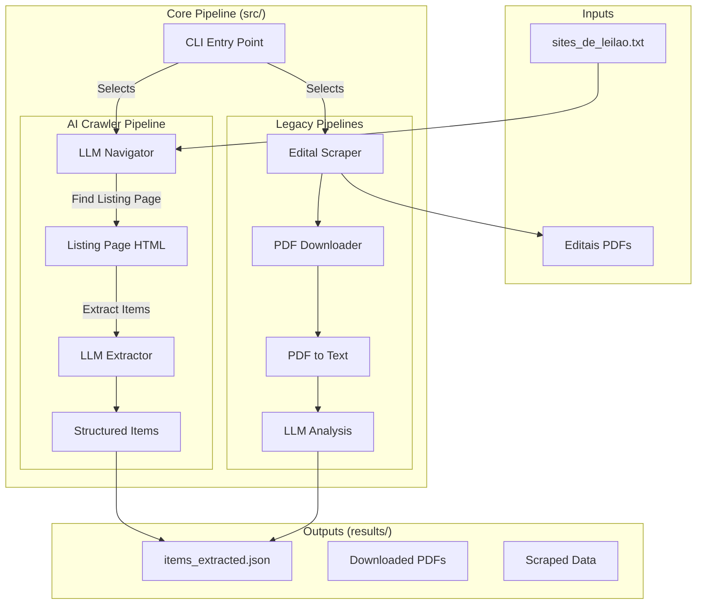

# Auction Scraper (AI-Crawler)

This project is a powerful AI-driven tool designed to discover and extract real estate auction opportunities from a diverse range of auctioneer websites.

Unlike traditional scrapers that rely on brittle CSS selectors, this crawler leverages **Large Language Models (Gemini Flash)** to intelligently navigate websites and extract unstructured data into a standardized format.

## Directory Structure

Run the code from the root `ai-crawler/` directory.

- **`src/`**: Contains the source code and the `auction_scraper` package.
- **`results/`**: Stores all output files (JSON data, downloaded PDFs, logs).
- **`aux/`**: Contains auxiliary files such as input lists (`sites_de_leilao.txt`) and configuration.

## Architecture

The system is built as a modular Python pipeline that separates discovery, extraction, and standardization.



## Installation

1.  Clone the repository.
2.  Navigate to the `ai-crawler` directory.
3.  Install the package in editable mode:

```bash
pip install -e .
```

*Required Environment Variable:*
```bash
export GEMINI_API_KEY="your_api_key_here"
```

## Usage

The tool is controlled via the `python -m auction_scraper.cli` entry point.

### 1. Crawl Real Estate Items (Recommended)
This is the main pipeline that visits auctioneer sites and finds properties.

```bash
# Run on the first 10 sites
python3 -m auction_scraper.cli --items --limit 10

# Resume from offset 10
python3 -m auction_scraper.cli --items --limit 10 --offset 10
```

### 2. Scrape Auction Notices (Editais)
Downloads and analyzes PDF notices.

```bash
python3 -m auction_scraper.cli --editais --limit 20
```

### 3. Scrape Auctioneer Registry
Updates the list of auctioneers.

```bash
python3 -m auction_scraper.cli --leiloeiros
```

## Roadmap & TODOs

### Automation & Pipeline
- [ ] **Pipeline Automation**: Create a scheduled cron job or airflow DAG to run the crawler daily.
- [ ] **Browser-Based Crawling**: Integrate a headless browser (Puppeteer/Playwright) for sites that require JS rendering (React/Vue apps).
- [ ] **Adaptive Strategy**: Implement a hybrid approach:
    - *Tier 1*: Fast HTTP crawling + LLM for simple sites.
    - *Tier 2*: Browser automation for complex sites.

### Data Management
- [ ] **De-duplication**: Implement a hash map mechanism (based on address + value + description) to prevent duplicate entries from multiple runs.
- [ ] **Database Integration**: Replace JSON output with **Supabase (PostgreSQL)** for persistence.
    - Schema: `items (id, title, valuation, minimum_bid, link, source_site, created_at, updated_at)`
- [ ] **Contrato Definition**: Define a strict JSON schema (Pydantic model) for the "Item" contract to ensure data quality.

### Visualization
- [ ] **Web Interface**: Build a frontend to list results, filter by value/location, and view photos.
# br-auction
# br-auction
